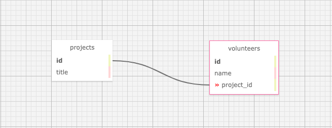

# Volunteer Tracker

#### By Frank Proulx
 
#### This is an app for a site that allows the user to add projects and volunteers, updating both and adding volunteers to projects

## Technologies Used

* Ruby
* Gems
* Bundler
* Rspec
* Pry
* Sinatra
* Capybara
* Postgres
* SQL
* SQL Designer

## Description

This site allows the user to add projects by name on the landing page, where they can view all projects and volunteers. They can then update or delete a project. The user is also able to add volunteers, which can be assigned to projects, as well as have their names updated. 

## Setup/Installation Requirements

* Create and/or navigate to the directory you would like to contain this project on your computer.
* Initialize a git repository by typing **git init** in the terminal.
* Type **git clone https://github.com/Frank-Proulx/w10_volunteer_tracker.git** to clone the repository to your local machine.
* Navigate into project directory by typing cd w10_volunteer_tracker  
* Type bundle install in the terminal to populate gems
* Type in your terminal:  
      `createdb volunteer_tracker`  
      `psql volunteer_tracker < database_backup.sql`  
      `createdb -T volunteer_tracker volunteer_tracker_test`
* After building the database, type rspec in the terminal to confirm passing of all tests  
* Type ruby app.rb to run the program with Sinatra
* Open browswer and enter the url "http://localhost:4567/" unless otherwise prompted in the terminal

## Known Bugs

No known bugs.

## License

[MIT](https://opensource.org/licenses/MIT)

If you have any issues, questions, ideas or concerns, please reach out to me at my email and/or make a contribution to the code via GitHub.  

Copyright (c) 2021 Frank Proulx

